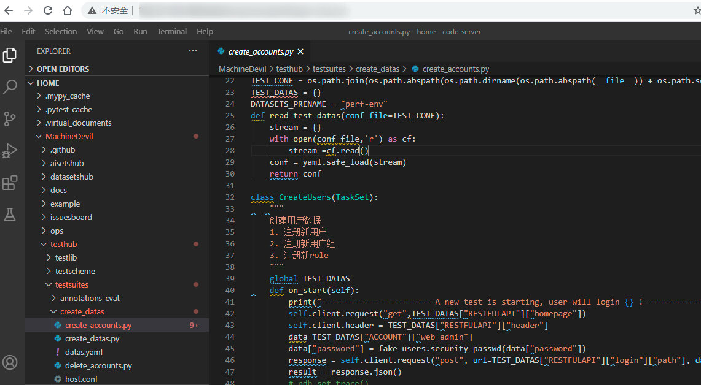

[](LICENSE)
[](https://machinedevil.readthedocs.io/zh_CN/latest/?badge=latest)

<!--  -->
<!-- [](https://gitter.im/MachineDevil/community?utm_source=badge&utm_medium=badge&utm_campaign=pr-badge)[](https://codecov.io/gh/banrieen/MachineDevil) -->
<!-- [](https://www.travis-ci.com/banrieen/MachineDevil) -->
[](https://github.com/banrieen/MachineDevil/actions/workflows/CI-Nightly.yml)


[English Doc](README.md) | [简体中文](README_zh_CN.md)

Base on apulis/MachineWolf!

**MachineDevil** is a Test Grounds for AI 、Deep Learning or Machine Learning framwork、platform. As the Best-Practice for build Application.

**Suport Env**
* Ubuntu 18.04 x86-64
* Python
* java(jmeter)
* node.js/deno
* Rust
* Go
* Git

**[Support Tools](https://github.com/ml-tooling/ml-workspace#features)**
* Jupyter
* Desktop GUI 
* VS Code
* JupyterLab
* Git Integration
* Access Ports 
* Tensorboard
* Hardware Monitoring
* SSH Access
* Job Execution

🍃 🍂 🍁 🍄 🐚 🍀 🌾 💐 🌷🦥 🐁 🐀 🐿 🦔 🐾 🐉 🐲 🌵 🎄 🌲 🌳 🌴 🌱

**😄 If it’s helpful to you, please click a Star, it is greatly appreciated!🍻 🥂💕 💞 💓**

🌼 🌻 🌞 🌝 🌛🌈 ☀️ 🌤 ⛅️ 🌥🌏 🪐 💫 ⭐️ 🌟 ✨ 🍐 🍊 🍋 🍌 🍉 🍇 🍓

### Quickly Start

* Execute testsuites in docker container

    1. Start container
    
    ```bash
    docker run -d -p 8088:8080  -p 8090:8090     --name "machindevil"  -v "${PWD}:/workspace"  --env NOTEBOOK_ARGS="--NotebookApp.notebook_dir=/home"  --shm-size 2048m  --restart always     banrieen/machinedevil:latest
    ```
* Open web IDE

    **http://<xxx.xxx.xxx.xxx>:8088/tools/vscode/**

    *And open foler `/home/MachineDevil`*
    

* Running locust scripts by taurus

    `bzt example/taurus/quick_test.yml`

* Running jmeter scripts by taurus

    `bzt example/jmeter/trace_user_footprint.jmx`

* Running yaml scripts by taurus 

    `bzt example/taurus/quick_test.yml`

* Runing pytest testsuites, such as non-api， HA， throughput test scripts

    `pytest example/pytest/test_ha.py`
    
* Also It allow you runing scripts at local PC

    ```bash
    sudo chmod +x init_dev.sh
    bash ./init_dev.sh
    locust -f ./example/locust/test_http.py --conf ./example/locust/host.conf
    ```
**Export testreport**

* `testreport/result.csv_stats.csv`
* `testreport/result.csv_stats_history.csv`
* `testreport/result.csv_failures.csv`
* `testreport/result.csv_exceptions.csv`

### About branch


| Branch name |Info|
| ----------- | -------------------------------------------------------------------- |
| Master      | The master branch maintains the latest release code of the released product, merges from Release or Feature to the official release history|
| Feature     | Opened from the Master branch, it is mainly used to develop new features or special test sets, which are maintained according to the responsible module; the naming convention is: feature/#..., each function should correspond to an issue,...is an issue number. |
| Hotfix      |	Opened from the Master branch, it is mainly used to fix known bugs in the currently released version; please refer to Bugfix for precautions when solving bugs. The naming convention is：hotfix/#... |
| Release	  | It is opened from the Master branch and is mainly used to release the version. Once the Master branch has enough functions to do a release (or the scheduled release day), fork a release branch from the Master branch. The newly created branch is used to start the release cycle. This branch should only be used for bug fixes, document generation, and other release-oriented tasks. Once the external release work is completed, perform the following three operations: merge the Release branch to the Master; tag the Master with the corresponding version; Release returns, and these changes since the new release branch must be merged back into the Master branch. The naming convention is：release/...，...as release No.|
| ngihtly     | Build every night to verify the examples and public libraries of the test suite to ensure that the relevant scripts are available.|

> [!IMPORTANT]
> Master tag To test the version number of the code base itself
> Releas tag Sync with the release/-x-tag of the product to be tested; if the tested product is 2.0.0-rc1, you can pull out a release/2.0.0-rc1
> Hotfix tag Same as the hostfix of the tested product, a hotfix can be pulled out during the test/#window stuck
> Feature tag Independently developed and researched feature prototype verification can pull a feature such as feature/#requirement or bug

* System testing and iterative testing can directly pull the latest code (tag) of the Master branch
* All Feature, Hotfix, and Release that have been debugged and verified must be merged into the Master


### About testsuites

* aisetshub:    About Model validation
* datasetshub:  About Data set validation
* testhub:      Platform, component test cases and scripts
* issuesboard:  Synchronize issues and reports

### Schema of test

The testsuites is an independent and flexible organization on the purpose of being inclusive and accommodating extraction. Support a variety of cutting-edge and excellent tools and concepts; currently test schemes (testscheme), data (datas.yaml), scripts (.py, .jmx), and execution plans (host.yml, taurus.yml) are flexibly unit.
There are still some examples that need to be improved and supplemented.

``` direction
|-- testhub/
    `-- testscheme
        |-- manufacturing
        |-- annotations
    `-- testsuites
        |-- annotations_app
            |-- host.conf
            |-- test_labels.py
            |-- datas.yaml
    `-- testlib
        |-- fake_users
        |-- postgres_client
        |-- csv_client
```

### Security

In order to avoid information leaks, invalid information floods.

* All test scripts, explanatory text and configuration files remove all ID, ACCOUNT, HOST information
* Do not retain any test environment information, and any test datas
* Replace sensitive information with canonical logs：

    + account： `<HOSTNAME>:<PASSWORLD>`
    + host： `<HOST>:<PORT>`
    + link： `<LINKTYPE>:<LINKADDRESS>`
    + cert： `<KEYGEN> 或 <TOKEN>`
    + email： `<EMAIL-NAME@EMAIL-SERVICE.COM>`

### Documents 

For more detailed information about installation guides, tutorials and APIs, please refer to[Docs](docs/zh_CN)

### Release

* **Latest**

    1. Complete package architecture
    2. Installation and environmental preparation
    3. Implementation example
    4. Basic testcases 

* **Planning**

    1. Supplement and improve the test libs
    2. Tuning the synchronization process to ZenTao 
    3. Debug the synchronization process between argo and testsuites
    4. Supplemental framework, model performance tools and scripts
    5. Integrate monitoring for k8s

**Please refer to the release notes for details[RELEASE](./RELEASE.md)。**

### Comunity

Welcome everyone to mention questions and suggestions to github issues

* [Gitter Discussion group](https://gitter.im/banrieen/MachineDevilHome?utm_source=share-link&utm_medium=link&utm_campaign=share-link)
* [#MachineDevil tag on StackOverflow](https://stackoverflow.com/search?q=%23MachineDevil)
* Twitter @MachinDevil
* wechat @MachinDevil

<p align="left">

</p>

* QQ group 868444294 
